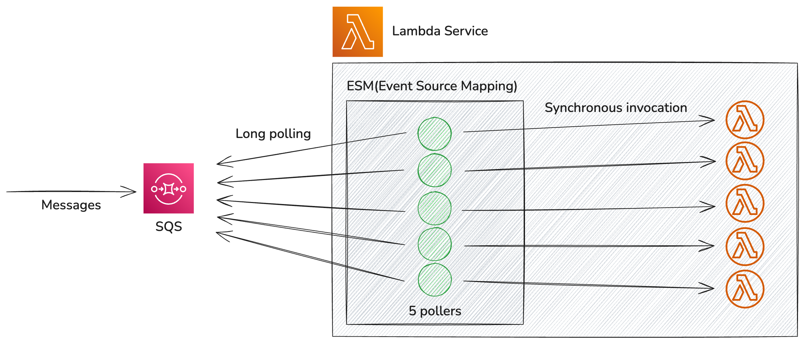

# How AWS Lambda works with Amazon SQS standard queues

AWS Lambda 함수를 사용하여 Amazon SQS 표준 대기열을 처리할 수 있습니다. 이 구성은 서버리스 아키텍처에서 높은 확장성과 효율성을 제공합니다. 이 글에서는 두 서비스의 상호작용 방식과 확장 메커니즘을 간단하게 정리합니다.

## Event source mapping

Lambda 서비스는 ESM(Event source mapping)이라는 리소스를 이용하여 SQS 메시지 트래픽을 long polling하고 Lambda 함수를 호출합니다. 이 polling 프로세스는 사용자가 직접 제어할 수 없으며, 자동으로 관리됩니다. 기본적으로 대기열이 비어 있을 때는 polling 비용을 낮추도록, 대기열이 많이 사용될 때는 높은 처리량으로 확장할 수 있도록 작동합니다.

## Polling과 Lambda 함수 확장

Lambda는 5개의 long polling 수행합니다. 기본 polling 간격은 20초이지만, 지속적인 메시지 트래픽이 있는 경우 이보다 더 짧아질 수 있습니다. 메시지 트래픽이 발생하면 Lambda는 5개의 함수 호출로 5개의 메세지 배치를 처리합니다. 처리 이후에도 대기열에 메시지가 남으면 Lambda는 분당 최대 300개의 함수 인스턴스를 추가하여 최대 1,000개로 확장할 수 있습니다.

## 이벤트 소스로서 SQS의 최대 동시성 제어

### Lambda 함수 호출의 동시성 제어

Lambda 함수의 인스턴스가 확장되어 SQS에 설정된 최대 동시성에 도달하면 ESM이 더 이상의 메시지 polling을 중단합니다. Lambda 함수 호출이 완료되면 다시 메시지를 polling합니다. 이 설정을 이용하여 이전까지 존재하던 Lambda 함수가 쓰로틀 되어 불필요하게 다시 처리되던 문제를 해결하고 원하는 속도로 메시지를 처리할 수 있습니다.

### 빈 메시지에 대한 비용 절약

메시지 트래픽이 없더라고 빈 메시지가 수신이 일어나며 이에 따른 비용이 발생합니다. 5개의 poller가 작동하기 때문에 분당 15개의 빈 메시지가 수신됩니다. 이 비용을 낮추기 위해서 SQS의 `maximum concurrency` 설정을 최소 단위인 2개로 제한할 수 있습니다. 이렇게되면 SQS 이벤트 소스가 호출할 수 있는 최대 Lambda 함수의 개수를 2개로 제한되어 분당 6개의 빈 메시지만 수신됩니다. (이 옵션이 poller 수를 줄인다는 설명을 문서에서 찾을 수는 없지만 CloudWatch를 통해 빈 메시지 수를 확인하여 간접적으로 관찰할 수 있는 부분입니다.)

## References

- [Using Lambda with Amazon SQS](https://docs.aws.amazon.com/lambda/latest/dg/with-sqs.html)

- [Configuring scaling behavior for SQS event source mappings](https://docs.aws.amazon.com/lambda/latest/dg/services-sqs-scaling.html)

- [Introducing maximum concurrency of AWS Lambda functions when using Amazon SQS as an event source](https://aws.amazon.com/ko/blogs/compute/introducing-maximum-concurrency-of-aws-lambda-functions-when-using-amazon-sqs-as-an-event-source/)

- [Introducing faster polling scale-up for AWS Lambda functions configured with Amazon SQS](https://aws.amazon.com/ko/blogs/compute/introducing-faster-polling-scale-up-for-aws-lambda-functions-configured-with-amazon-sqs/)

- [Understanding Amazon SQS and AWS Lambda Event Source Mapping for Efficient Message Processing](https://aws.amazon.com/ko/blogs/apn/understanding-amazon-sqs-and-aws-lambda-event-source-mapping-for-efficient-message-processing/)

- [Does Maximum Concurrency Solve the Lambda+SQS Issue?](https://zaccharles.medium.com/does-maximum-concurrency-solve-the-lambda-sqs-issue-3c19701e6e75)
